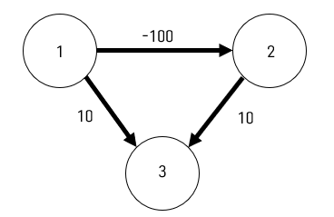

# Dijkstra-negative_edge-example
Dijkstra도 음수 간선에서 동작하는 모습을 보며, Bellman Ford알고리즘과 비교해봅니다.

위와 같은 그래프가 있습니다.

우리는 보통 다익스트라를 배우고 난 뒤에 
"음수 간선" 간선에서 동작하는 Bellman Ford 알고리즘을 공부합니다.

하지만 "음수 간선"이라는 조건만으로 다익스트라가 작동하지 못할까요?