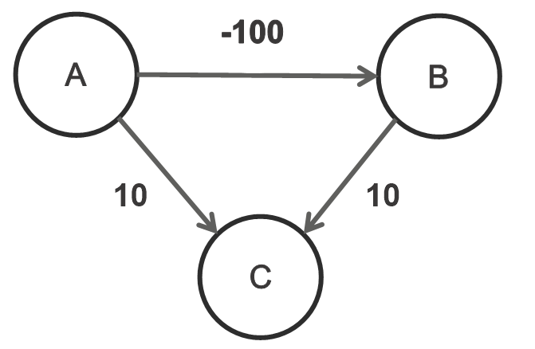
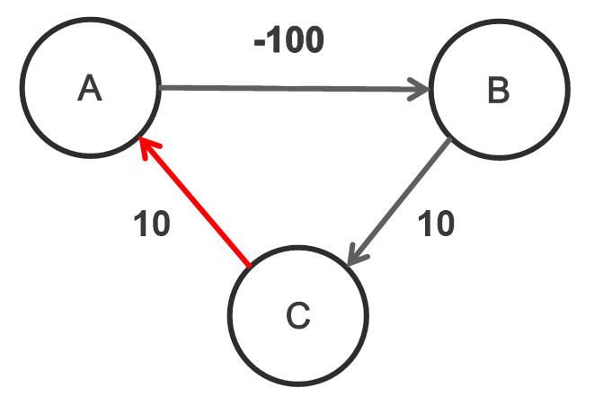

# Dijkstra-negative_edge-example
Dijkstra도 음수 간선에서 동작하는 모습을 보며, Bellman Ford알고리즘과 비교해봅니다. 아래와 같은 그래프가 있습니다.




우리는 보통 다익스트라를 배우고 난 뒤에 
"음수 간선" 간선에서 동작하는 Bellman Ford 알고리즘을 공부합니다. 하지만 "음수 간선"이라는 조건만으로 다익스트라가 작동하지 못할까요? 
## 아닙니다.

아래 명령어를 통해 동작시켜 보면 잘 작동함을 알 수 있어요

__command__
```
python3 Dijkstra.py
```

__result__

```
{'A': 0, 'B': -100, 'C': -90}
```

---------------------------------------

그럼 '어떤 경우'에 음수 간선에서 다익스트라를 쓰면 안될까요? 바로 '음수 사이클'이 존재할 때입니다.



똑같이 실행해볼까요? 


__command__
```
python3 Dijkstra.py
```

__result__

```

```
__큐가 비워지지 않아 프로그램이 멈추지 않는 것을 확인할 수 있어요__

---------------------------------------

### 결론
__음수 간선이 있어도 '다익스트라'는 됩니다.__ 

__'음수 간선을 포함하는 사이클'이 사이클을 순회할수록 계속해서 작은 값이 갱신될 수 있을 때
다익스트라가 되지 않는 것입니다.__

하지만 음수 간선 나오면(알고리즘 문제 등) __벨만 포드를 항상 고려하는 것이 정신건강에 이롭습니다.__ 문제가 어떻게 나올지 모르기 때문입니다.

